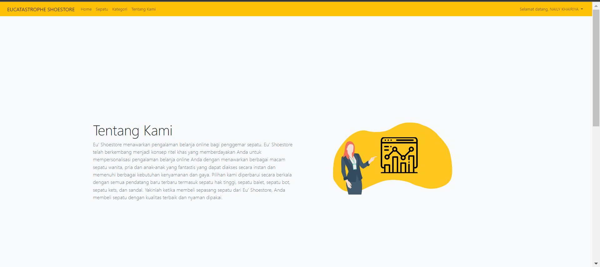
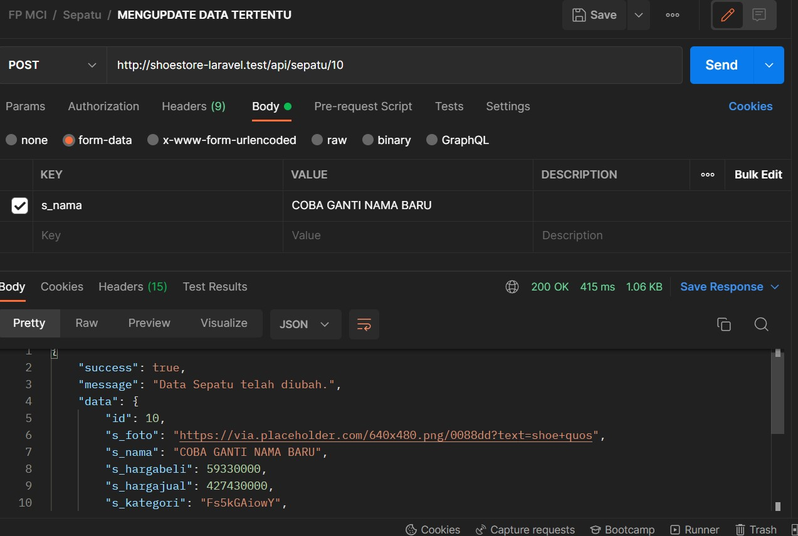

# Final Project Oprec MCI 2022

## Eucatastrophe | Shoestore

Aplikasi sederhana ini berupa e-commerce untuk toko sepatu. Tujuannya supaya penjualan sepatu bisa lebih tersebar luas melalui aplikasi tersebut.

## Fitur Aplikasi

List fitur pada aplikasi ini adalah sebagai berikut.

1. Melihat list sepatu
2. Menambahkan sepatu
3. Mengedit detail sepatu
4. Menghapus sepatu
5. Tampilan Home
6. Tampilan Sepatu yang baru
7. Tampilan Kategori Sepatu
8. Tampilan Tentang Kami
9. Tampilan Dashboard tapi belum selesai :)
10. Login
11. Registrasi
12. API

## Tampilan Aplikasi

### Fitur 1: Melihat list sepatu

### Fitur 2: Menambahkan sepatu

- Tampilan menambahkan sepatu

- Berhasil menambahkan sepatu

### Fitur 3: Mengedit detail sepatu

- Tampilan mengedit sepatu

- Berhasil mengedit sepatu

### Fitur 4: Menghapus sepatu

- Pesan saat akan menghapus

- Berhasil menghapus

### Fitur 5: Tampilan Home

### Fitur 6: Tampilan Sepatu yang baru

- Penggunaan Carousel

- Penggunaan fitur search

- Tombol tambah sepatu untuk admin

- Tampilan untuk admin (bisa edit dan hapus data sepatu)

- Tampilan untuk nonadmin

- Detail produk

- Tambah ukuran masih error, tapi tampilan aman sampai ke formnya

- Menampilkan produk lainnya

- Penggunaan pagination

### Fitur 7: Tampilan Kategori Sepatu

- tampilan pemilihan kategori

- tampilan pemilihan berdasarkan kategori tertentu (kategori menggunakan relation many to many)

### Fitur 8: Tampilan Tentang Kami

### Fitur 9: Tampilan Dashboard belum selesai :)

### Fitur 10: Login

### Fitur 11: Registrasi

### Fitur 12: Admin

- masih manual dari database. Tetapi sudah ada pembedaan untuk admin dan pengguna biasa maupun untuk yang sudah teregister. Beberapa fitur tidak bisa diakses tanpa login

### Fitur 12: API

- Mendapatkan semua data sepatu

- Mendapatkan data sepatu id tertentu

- Mendapatkan tambah sepatu

- Delete data

- Update data

